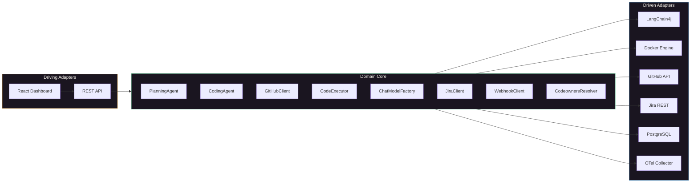

# Agentic SDLC

**Autonomous Software Delivery Platform**

*From Jira ticket to Pull Request — zero human intervention.*

A platform that orchestrates the full software development lifecycle autonomously. Feed it a Jira ticket or a natural language prompt. It plans the implementation, writes code in a sandboxed environment, runs tests, and opens a GitHub pull request with the right reviewers — all without human involvement.

Built with **Hexagonal Architecture** (Ports & Adapters), **Domain-Driven Design**, and **vertical slice** packaging. Every external system — LLM providers, Docker containers, GitHub API, Jira — sits behind a typed interface. Swap any adapter without touching the domain.


---

## The Pipeline


**Three milestones, fully implemented:**

| Milestone | Input | Output | How |
|-----------|-------|--------|-----|
| **M1 — Planning** | Jira ticket or prompt | Structured plan (tasks, files, risks) | LangChain4j AiServices, structured JSON output |
| **M2 — Coding** | Approved plan | Unified diff + test results | Agentic tool-use loop in ephemeral Docker container |
| **M3 — GitHub** | Diff from coding run | Branch + PR with reviewers | PAT or GitHub App auth, CODEOWNERS, Spring Retry |

---

## Screenshots

<table>
<tr>
<td width="50%">

**Plan Detail** — structured tasks, files to touch, risks


</td>
<td width="50%">

**Coding Run** — iterations, tokens, GitHub-style diff


</td>
</tr>
<tr>
<td width="50%">

**Pull Request** — labels, reviewers, merge controls


</td>
<td width="50%">

**New Plan** — prompt or Jira input


</td>
</tr>
</table>

---

## Architecture

**Hexagonal Architecture** with strict port/adapter separation at every boundary:



**Every external dependency is mockable. Every adapter is swappable. Zero framework leakage into domain logic.**

### Vertical Slices

```
src/main/java/com/agenticdev/sdlc/
├── planning/          M1: prompt → structured plan
│   ├── api/           REST controller + DTOs
│   ├── domain/        PlanningService, PlanningAgent (port), PlanResult
│   ├── agent/         LangChain4j AiServices adapter
│   └── persistence/   JPA entity + repository
├── coding/            M2: plan → code via agentic loop
│   ├── api/           REST controller + DTOs
│   ├── domain/        CodingService, CodingAgent (port), CodeExecutor (port)
│   ├── agent/         Tool-use loop adapter (@Tool readFile/writeFile/runCommand)
│   ├── executor/      DockerCodeExecutor adapter (sandboxed container)
│   └── webhook/       RestWebhookClient adapter
├── github/            M3: diff → branch + PR
│   ├── api/           REST controller + DTOs
│   ├── domain/        PullRequestService, GitHubClient (port)
│   ├── auth/          PAT + GitHub App adapters (kohsuke client)
│   ├── pipeline/      DockerDiffApplier, CodeownersResolver adapters
│   └── persistence/   JPA entity + repository
├── llm/               Shared: multi-provider ChatModel factory
├── jira/              Shared: Jira REST client adapter
└── observability/     Shared: OpenTelemetry + Micrometer
```

Each slice owns its full stack. New features sit alongside existing ones without touching them.

---

## Tech Stack

| Layer | Technology | Why |
|-------|-----------|-----|
| **Language** | Java 21 | Virtual threads ready, pattern matching, records |
| **Framework** | Spring Boot 4.0.3 | Latest stable, native compilation path |
| **LLM** | LangChain4j 1.12.1 | AiServices for structured output, @Tool for agentic loops |
| **LLM Providers** | OpenAI, Anthropic, Bedrock, Ollama, LM Studio | Per-request provider selection |
| **Database** | PostgreSQL 16 + Flyway | JSONB for structured plans, 3 migration files |
| **Containers** | Docker (Java client) | Ephemeral sandbox per coding run, no-network isolation |
| **GitHub** | kohsuke/github-api + Spring Retry | PAT and App auth, retryable with exponential backoff |
| **Observability** | OpenTelemetry + Micrometer + Prometheus | Traces, metrics, traceId in every error response |
| **Frontend** | React 19, Vite 6, TypeScript, Recharts | Glassmorphism dashboard, GitHub-style diff viewer |
| **Testing** | JUnit 5, Mockito, AssertJ, WireMock | 87 unit tests across all milestones |

---

## Quick Start

```bash
git clone https://github.com/<you>/agentic-sdlc.git
cd agentic-sdlc

cp .env.example .env
# Enable at least one LLM provider in .env

docker compose up --build
```

| Service | URL |
|---------|-----|
| Dashboard | http://localhost:3000 |
| REST API | http://localhost:8088 |
| Swagger UI | http://localhost:8088/swagger-ui.html |
| Prometheus | http://localhost:8088/actuator/prometheus |

Demo data seeds automatically on first start.

---

## API

### Plans
```bash
# Create from prompt
curl -s localhost:8088/api/v1/plans \
  -H 'Content-Type: application/json' \
  -d '{"inputType":"PROMPT","prompt":"Add rate limiting to /search"}' | jq

# Create from Jira
curl -s localhost:8088/api/v1/plans \
  -H 'Content-Type: application/json' \
  -d '{"inputType":"JIRA","jiraKey":"PROJ-123","provider":"ANTHROPIC"}' | jq
```

### Coding Runs
```bash
# Start autonomous coding (returns 202, runs async)
curl -s localhost:8088/api/v1/coding-runs \
  -H 'Content-Type: application/json' \
  -d '{"planId":"<id>","repoUrl":"https://github.com/org/repo.git","autoOpenPr":true}' | jq

# Poll status
curl -s localhost:8088/api/v1/coding-runs/<id> | jq '.status,.testsPassed,.filesChanged'
```

### Pull Requests
```bash
# Manual PR creation
curl -s localhost:8088/api/v1/pull-requests \
  -H 'Content-Type: application/json' \
  -d '{"codingRunId":"<id>","draft":true}' | jq

# Merge
curl -s -X POST localhost:8088/api/v1/pull-requests/<id>/merge \
  -H 'Content-Type: application/json' \
  -d '{"strategy":"SQUASH"}' | jq
```

### All Endpoints

| Method | Path | Status | Description |
|--------|------|--------|-------------|
| `POST` | `/api/v1/plans` | 200 | Create plan (sync) |
| `GET` | `/api/v1/plans/{id}` | 200 | Plan detail |
| `GET` | `/api/v1/plans` | 200 | List plans (paginated) |
| `POST` | `/api/v1/coding-runs` | 202 | Start coding run (async) |
| `GET` | `/api/v1/coding-runs/{id}` | 200 | Run detail + diff |
| `GET` | `/api/v1/coding-runs/{id}/diff` | 200 | Raw diff (text/plain) |
| `GET` | `/api/v1/coding-runs` | 200 | List runs (paginated) |
| `POST` | `/api/v1/pull-requests` | 202 | Create PR (async) |
| `GET` | `/api/v1/pull-requests/{id}` | 200 | PR detail |
| `GET` | `/api/v1/pull-requests` | 200 | List PRs (paginated) |
| `POST` | `/api/v1/pull-requests/{id}/ready` | 200 | Draft → ready |
| `POST` | `/api/v1/pull-requests/{id}/merge` | 200 | Merge PR |
| `POST` | `/api/v1/pull-requests/{id}/comments` | 201 | Post comment |

---

## Key Design Decisions

### Sandboxed Code Execution
Every coding run provisions an **ephemeral Docker container** with `--network none`, configurable memory/CPU limits, and a disposable filesystem. The LLM can only interact through four tools: `readFile`, `writeFile`, `listFiles`, `runCommand`. All tool calls route through `docker exec`. Container destroyed in `finally` regardless of outcome.

### Budget Enforcement
Four configurable limits checked after every tool invocation:
- **Token budget** — total tokens consumed
- **Iteration cap** — number of tool calls
- **Wall-clock timeout** — elapsed time
- **Container resources** — memory + CPU enforced by Docker

Any limit triggers graceful termination with `TIMED_OUT` status and the specific reason recorded.

### Async with Webhook
Long-running operations (coding runs, PR creation) return `202 Accepted` immediately. A bounded `ThreadPoolTaskExecutor` processes work. Callers either poll `GET /{id}` or provide a `webhookUrl` for push notification.

### PENDING Row First
Every request writes a `PENDING` database row before starting work. If the server crashes mid-operation, the row remains auditable. Terminal state written in a separate transaction after completion.

### Per-Request Provider Selection
The caller picks the LLM provider in the request body. Five providers configured via `@ConditionalOnProperty`. Missing provider → typed 400 error. Default provider configurable for requests that omit it.

---

## Testing

```bash
# 87 unit tests (no Docker required)
./mvnw test -Dtest='!PlanRepositoryTest,!PlansControllerIT,!CodingRunsControllerIT'

# Full suite (requires Docker for Testcontainers)
./mvnw test
```

| Suite | Tests | Covers |
|-------|-------|--------|
| Planning (M1) | 29 | Service orchestration, validation, exception mapping, record state transitions |
| Coding (M2) | 24 | Budget enforcement, tool-use, container cleanup, webhook delivery |
| GitHub (M3) | 34 | PR lifecycle, CODEOWNERS glob parsing, config validation, retry behavior |

---

## Documentation

| Document | Description |
|----------|-------------|
| [Architecture](docs/architecture.md) | System design, data flow diagrams, hexagonal boundaries |
| [How to Run](docs/how-to-run.md) | Setup, all 5 LLM providers, GitHub config, API examples |
| [Roadmap](docs/roadmap.md) | Planned: Review Agent, RAG, CI/CD, AWS deploy, streaming |

---

## License

